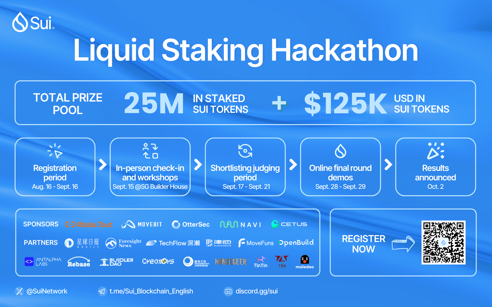

近期，Sui协议已升级支持流动性质押，Sui基金会现邀请开发者参加流动性质押黑客松，助力资产再流通。黑客松已于8月16日正式开启注册，并于9月27-30日以Demo Day的形式角逐，结果将于10月2日公布。此次黑客松的奖池包括2500万个质押的SUI Token（流动质押池中的项目）和价值12.5万美元的SUI Token。
# 时间安排
- 注册报名：8月16日-9月15日
- 现场报道和研讨会：9月15-16 日（Builder House新加坡站）
- 初赛选拔：9月17-21日
- 入围名单公布：9月22日
- Demo Day：9月27-30日
- 结果公布：10月2日
> 立即注册：https://web.miniextensions.com/HcXRRr8kdgokxIZ5xVcM

# 参赛类别
参赛项目应属于以下两个类别之一：
## 流动性质押协议：
- 非托管流动质押L1实施方案
- LST DeFi和工具
## 基于LST衍生品的产品（LST DeFi和其他LST L2产品）
- LST相关的工具和基础设施

# 参赛资格
为了获得参赛资格，项目必须满足以下条件
- 团队或个人均可提交项目，Sui基金会将帮助大家组建团队
- 在Demo Day之前部署在Sui主网或测试网上
- 在Sui上使用某种形式的流动性质押原语
- 项目的流动性质押功能必须处于非托管状态
- 开发团队中至少一名成员必须：能够参加9月底在线Demo Day，并通过KYC领取奖品
- 通过保留与任何验证节点进行质押的自主权，或者使用对促进生态系统有益的质押算法方案来促进去中心化
- 如果项目获奖，选择接收Sui基金会质押的SUI，该项目必须通过智能合约审核并部署至Sui主网上
- 已构建在Sui上的项目，必须新增流动性质押功能，才可参与此次比赛

# Workshops
参赛项目将获得由Sui基金会团队和其他黑客松合作伙伴和支持者提供的开发Workshops，主题包括SUI质押机制、动态字段以及Sui上的同质化和非同质化Token，更具体的细节将很快发布。

# 奖项设置

- 流动质押协议（2500万枚质押的SUI）
- 2500万枚质押的SUI将平分并存入前三名获奖项目中
- 前三名获奖项目需要各接受两次安全审核
- Sui基金会将从每个流动性质押协议中获得的流动性，分配给其他符合条件的生态系统协议，进一步支持Sui的DeFi生态系统。分配此类流动质押token的具体流程和接收资格将在未来公布。

# LST DeFi和工具（10万美元SUI Token）
- 第一名：价值5万美元的SUI Token
- 第二名：价值3万美元的SUI Token
- 第三名：价值2万美元的SUI Token

# 荣誉奖（2.5万美元SUI Token）
- 价值25,000美元的SUI Token平均分配给未进入任一类别前三名的所有入围团队。

如果您对黑客松有任何疑问，可以加入黑客松Slack工作区并提问。
中文开发者可以加入Sui中文电报群:  https://t.me/sui_dev_cn并提问。
您可以在黑客松中文页面上找到更多信息，并且可以立即完成申请进行注册。